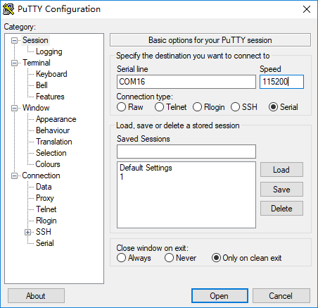
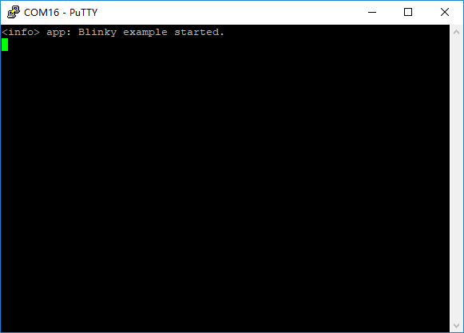
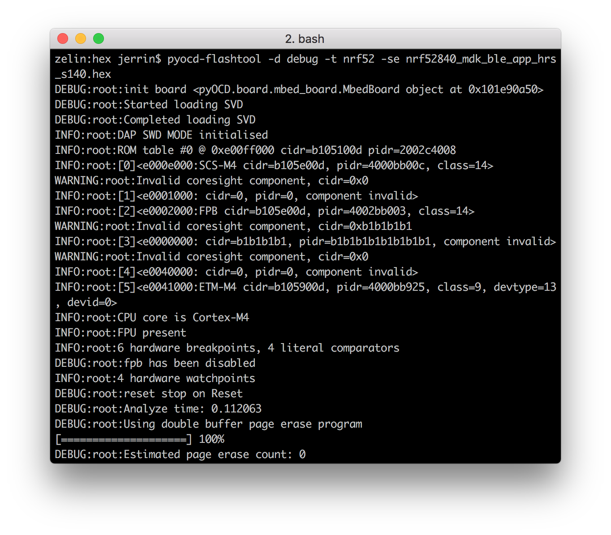

# Getting started with the nRF52840-MDK Board

!!! success "Congratulations on getting the nRF52840-MDK!"
    On this page we'll show you how to connect and power up your nRF52840-MDK, and what to expect when you do so. This will take about 20 minutes.

## What's Included

Once you receive your nRF52840-MDK development kit, you will find the following parts:

* The nRF52840-MDK Board
* The USB 3.1 Type-C to USB 2.0 Type-A Male Cable


## Connecting the board

!!! note
    You need a reasonably current Mac/Linux/Windows PC and a iPhone or Android phone to perform the following.

You can connect the board by performing the following steps:

 1. Connect the nRF52840-MDK to one of your PC's USB host ports. This provides power to the board. Observe that two GREEN LEDs are on. One indicates that USB power is good, and another indicates that the application is advertising.

 2. Open a file explorer. Confirm that the board has appeared as a removable drive named **DAPLINK**. This allows you to program the nRF52840 chip. You'll do this under "[how to program your nRF52840-MDK](#how-to-program-your-nrf52840-mdk)" below.


## Using terminal applications

Terminal applications (for example [PuTTY](https://www.chiark.greenend.org.uk/~sgtatham/putty/) or [screen](https://www.gnu.org/software/screen/manual/screen.html)) run on your host PC. They provide a window where your board can print messages.

You can connect your board to your computer over USB. This should work out of the box on Linux and macOS, but for Windows earlier than Windows 10, you will probably need to install a serial port driver:

1. Download the [Arm Mbed Windows serial port driver](http://os.mbed.com/media/downloads/drivers/mbedWinSerial_16466.exe).

2. Plug in your board over USB. It mounts as a drive.

3. Close all Explorer windows showing the drive.

4. Run the installer. This may take some time or display a few "unsigned driver" warnings.

!!! info "Serial configuration"
    The default setup for the USB serial port is 115200 baud, 8 bits, 1 stop bit, no parity (115200-8-N-1)

### On Windows

There are many terminal applications for Windows, [PuTTY](https://www.chiark.greenend.org.uk/~sgtatham/putty/) is recommended.

Start PuTTY and open the used COM port with the following configuration. If there is nothing printed, just press RESET button on the board.





### On macOS

[screen](https://www.gnu.org/software/screen/manual/screen.html) should work on macOS. In Terminal, run:

``` sh
$ screen /dev/cu.usbmodem1412 115200
```

If there is nothing printed, just press RESET button on the board.

!!! tip
    You can type `screen /dev/cu.usb` first, and then press <kbd>tab</kbd>. The device name will autocomplete.

    To end a screen session, type <kbd>Ctrl</kbd> + <kbd>A</kbd>, and then <kbd>K</kbd>. At the bottom of the Terminal window, you should see a `[y/n]` prompt. Type <kbd>y</kbd>.


### On Linux

[screen](https://www.gnu.org/software/screen/manual/screen.html) should work on Linux. If for some reason it doesn't, you can try one of the following:

* [CoolTerm](http://freeware.the-meiers.org/)

* [Minicom](https://help.ubuntu.com/community/Minicom)

Here we will use [screen](https://www.gnu.org/software/screen/manual/screen.html) on Ubuntu 16.04 for example. If there is nothing printed, just press RESET button on the board.

``` sh
$ sudo apt-get install screen
```

``` sh
$ sudo screen /dev/ttyACM0 115200
```


## Using nRF Connect

You can also test the application with the **nRF Connect** mobile app by performing the following steps:

1. Get the **nRF Connect** app from App Store or Google Play.

2. Connect to the device from **nRF Connect** (the device is advertising as *nRF52840-MDK*).

3. Observe that BLUE LED is on and GREEN LED is off. This indicates that the connections is established.

4. Observe that the *LED Button Service* is shown in the connected device and then you can enable services for the Button Characteristic by clicking the *Play* button.

5. Notifications are received on the Button Characteristic (0x1524) when pressing or releasing the USER Button.

6. Write `01` to the *Nordic Blinky LED* Characteristic (0x1525) and observe that RED LED is turned on.

7. Write `00` to the *Nordic Blinky LED* Characteristic (0x1525) and observe that RED LED is turned off.

[](images/ble_app_blinky_demo.jpg)

## How to program your nRF52840-MDK

You have the following two options to program your board: 

* [Drag-n-drop Programming](#drag-n-drop-programming)

* [Using pyOCD](#using-pyocd).

You can take the [Heart rate monitor](https://github.com/makerdiary/nrf52840-mdk/tree/master/examples/nrf5-sdk/ble_app_hrs/) demo as an example. 

<a href="https://github.com/makerdiary/nrf52840-mdk/tree/master/examples/nrf5-sdk/ble_app_hrs/hex"><button data-md-color-primary="marsala">Get the firmware</button></a>

!!! note
	Make sure you have installed the **nRF Toolbox** mobile app before you start. Just search **nRF Toolbox** in the App Store or Google Play.

### Drag-n-drop Programming

Drag and drop the hex file into the **DAPLINK** removable drive mentioned above. The file contains firmware which will be automatically programmed onto the nRF52840 SoC. When programming is completed, the removable drive will be re-detected by the computer. The application will run after pressing the RESET button.


!!! note 
    You should merge the application and SoftDevice before drag-n-drop programming an example with SoftDevice. `mergehex` can be used to merge the hex files. You can find it in the [nRF5x Command Line Tools](http://infocenter.nordicsemi.com/index.jsp?topic=%2Fcom.nordic.infocenter.tools%2Fdita%2Ftools%2Fnrf5x_command_line_tools%2Fnrf5x_installation.html).

### Using pyOCD

pyOCD is an Open Source python 2.7 based library for programming and debugging ARM Cortex-M microcontrollers using CMSIS-DAP. Linux, OSX and Windows are supported.

The latest stable version of pyOCD may be installed via [pip](https://pip.pypa.io/en/stable/index.html) as follows:

``` sh
$ pip install --pre -U pyocd
```

Alternatively, to install the latest development version (master branch), you can do the following:

``` sh
$ pip install --pre -U https://github.com/mbedmicro/pyOCD/archive/master.zip
```

!!! note
    You may run into permissions issues running these commands. You have a few options here:

    * Run with `sudo -H` to install pyOCD and dependencies globally
    * Specify the `--user` option to install local to your user
    * Run the command in a [virtualenv](https://virtualenv.pypa.io/en/latest/) local to a specific project working set.


You can verify that your board is detected by pyOCD by running:

``` sh
$ pyocd-flashtool -l
```

and then flash the board by running:

``` sh
$ pyocd-flashtool -d debug -t nrf52 -se nrf52840_mdk_ble_app_hrs_s140.hex
```



### Verify new firmware

After programming the demo firmware, you can interact with the **nRF Toolbox** mobile app to check if it works correctly. 

Open the App and tap **HRM** icon, and then connect your board which is advertising as *Nordic_HRM*. The nRF Toolbox app displays the curve.


## Clone the repository 

Clone the `makerdiary/nrf52840-mdk` repository or download it as a zip package and put its contents to your working directory.

``` sh
$ git clone https://github.com/makerdiary/nrf52840-mdk.git
```

This repository provides documents and example applications that you can run on your nRF52840-MDK to ensure that everything is set up correctly.

**Enjoy the demos and your nRF52840-MDK!**

## Create an Issue

Interested in contributing to this project? Want to report a bug? Feel free to click here:

<a href="https://github.com/makerdiary/nrf52840-mdk/issues/new"><button data-md-color-primary="marsala"><i class="fa fa-github"></i> Create an Issue</button></a>

