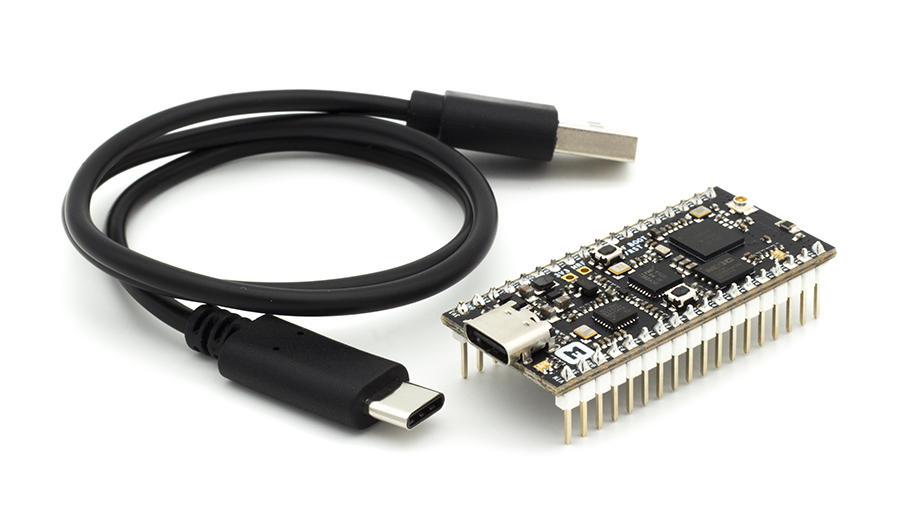

# nRF52840-MDK  <small>An Open-Source, Micro Development Kit for IoT Applications using the nRF52840 SoC</small>

## Description

The nRF52840-MDK is a versatile, easy-to-use IoT hardware platform for *Bluetooth 5*, *Bluetooth Mesh*, *Thread*, *IEEE 802.15.4*, *ANT* and 2.4GHz proprietary applications using the nRF52840 SoC.

The development kit comes with a fully integrated debugger (also known as [DAPLink](https://os.mbed.com/docs/latest/tools/daplink.html)) that provides USB drag-and-drop programming, USB Virtual COM port and CMSIS-DAP interface.

The kit contains a Microchip USB 2.0 Hi-Speed hub controller with two downstream ports: one for DAPLink interface and one for nRF52840 USB device controller. The kit also features ultra-low power 64-Mb QSPI FLASH memory, programmable user button, RGB LED, up to 24 GPIOs, antenna selection for custom applications.

It supports the standard Nordic Software Development Tool-chain using GCC, Keil and IAR. It can also be used to play with many popular frameworks, such as nRF5 SDK, nRF5 SDK for Mesh, OpenThread, ZigBee 3.0, Mbed OS 5, Zephyr, Mynewt, Web Bluetooth, iBeacon, Eddystone, and more.

## Hardware Features

* Nordic nRF52840 System-on-Chip
	- ARM® Cortex®-M4F processor optimized for ultra-low power operation
	- Combining *Bluetooth 5*, *Bluetooth Mesh*, *Thread*, *IEEE 802.15.4*, *ANT* and *2.4GHz proprietary*
	- On-chip NFC-A tag
	- On-chip USB 2.0 (Full speed) controller
	- ARM TrustZone® Cryptocell 310 security subsystem
	- 1 MB FLASH and 256 kB RAM
* Program/Debug options with DAPLink
	- MSC - drag-n-drop programming flash memory
	- CDC - virtual com port for log, trace and terminal emulation
	- HID - CMSIS-DAP compliant debug channel
	- WEBUSB HID - CMSIS-DAP compliant debug channel
* Microchip 2-Port USB 2.0 Hi-Speed Hub Controller
* External ultra-low power 64-Mb QSPI FLASH memory
* Up to 24 GPIOs available via headers
* IF Boot/Reset Button
* User programmable Button and RGB LED
* On-board 2.4G chip antenna 
* U.FL connector selectable for external antenna
* 3.3V regulator with 1A peak current output
* VBUS & VIN Power-Path Management
* Reversible USB 3.1 Type-C Connector
* Breadboard-friendly with dual 18-Pin headers
* Measures 1.97" x 0.9" x 0.51" (50mm x 23mm x 13mm) with headers soldered in

## Pinout Diagram

## Software Resource

The nRF52840-MDK can be used to play with : *nRF5 SDK*, *nRF5 SDK for Mesh*, *OpenThread*, *Mbed OS 5*, *Zephyr*, *Mynewt*, *Web Bluetooth*, *Eddystone*, and more.

| Framework  | Brief Description |
| ---------- | ----- |
| [nRF5 SDK](nrf5-sdk/) | Offical Software Development Kit for nRF51 and nRF52 Series |
| [nRF5 SDK for Mesh](mesh/) | Software Development Kit for Bluetooth mesh solutions using nRF51 Series and nRF52 Series |
| [OpenThread](openthread/) | An open-source implementation of Thread® released by Nest |
| [Arm Mbed OS](mbedos/) | An open-source platform operating system designed for the internet of things |
| [Zephyr](zephyr/) | A Small, Scalable Open Source RTOS for Internet of Things Embedded Devices |
| [Mynewt](mynewt/) | An OS to build, deploy and securely manage billions of devices |
| [Arm Mbed DAPLink](daplink/) | An open-source software project that enables programming and debugging application running on Arm Cortex CPUs |
| [Web Bluetooth](https://webbluetoothcg.github.io/web-bluetooth/) | Bluetooth support for the Web |
| [iBeacon](https://developer.apple.com/ibeacon/) | A Bluetooth low energy advertising message format designed by Apple |
| [Eddystone](https://github.com/google/eddystone) | A protocol specification that defines a Bluetooth low energy message format for proximity beacon messages |

## Hardware Resource

| Releases | Design Files                   |
| -------- | ------------------------------ |
| V1.0     | [nRF52840-MDK V1.0 Pinout Diagram](hardware/nrf52840-mdk-pinout-diagram-v1_0.pdf) [nRF52840-MDK V1.0 Schematic](hardware/nrf52840-mdk-schematic_v1_0.pdf) [nRF52840-MDK V1.0 Board File](hardware/nrf52840-mdk-board-file_v1_0.pdf) [nRF52840-MDK V1.0 3D STEP](hardware/nrf52840-mdk-3d-step-v1_0.step)|

## Create an Issue

Interested in contributing to this project? Want to report a bug? Feel free to click here:

<a href="https://github.com/makerdiary/nrf52840-mdk/issues/new"><button data-md-color-primary="marsala"><i class="fa fa-github"></i> Create an Issue</button></a>

