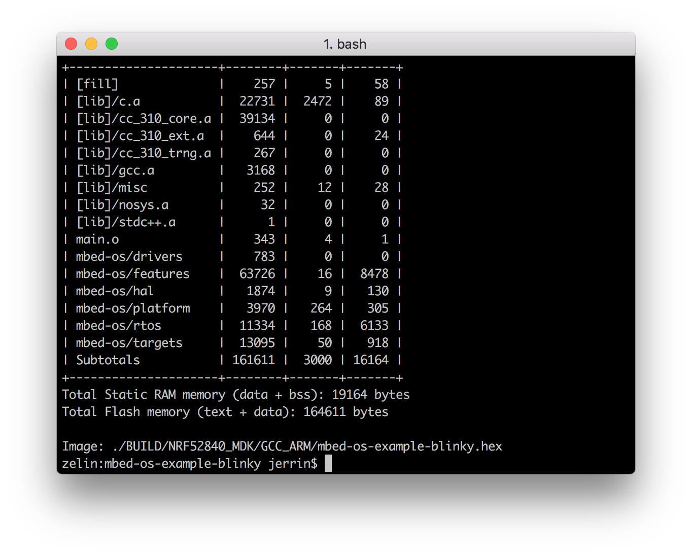

# Arm Mbed OS <br><small>An open-source platform operating system designed for the internet of things</small>

[](https://www.mbed.com/en/platform/mbed-os/)

## Introduction

[Arm Mbed OS](https://www.mbed.com/) is an open source embedded operating system designed specifically for the "things" in the Internet of Things. It includes all the features you need to develop a connected product based on an Arm Cortex-M microcontroller, including security, connectivity, an RTOS and drivers for sensors and I/O devices.

Mbed OS provides a platform that includes:

* Security foundations.
* Cloud management services.
* Drivers for sensors, I/O devices and connectivity.

Arm Mbed OS lets you write applications that run on embedded devices, by providing the layer that interprets your application's code in a way the hardware can understand.

Your application code is written in C and C++. It uses the application programming interfaces (APIs) that Mbed OS provides. These APIs allow your code to work on different microcontrollers in a uniform way. This reduces the challenges of getting started with Arm-based microcontrollers and integrating large software projects.

!!! info
	Mbed OS is now a Thread Certified Component. Using IPv6 with 6LoWPAN as the foundation, Thread technology provides a low-power, self-healing mesh network designed for the home.

For more information, please visit the [Mbed OS developer site](https://os.mbed.com/).

## Using Arm Mbed CLI

In the Arm Mbed ecosystem, you have a choice in how you want to develop, Online and Offline. For offline development, Arm Mbed CLI is provided. Mbed CLI is compatible with Windows, Linux and macOS. This option provides more configuration options but also requires slightly more setup.

### Install Mbed CLI

The setup process for Arm Mbed CLI depends on your operating system. Please choose your host operating system. The setup instructions for each operating system walk you through how to install Mbed CLI locally.

On Windows the easiest way to install Mbed CLI to run the [Mbed CLI Windows .exe installer](https://mbed-media.mbed.com/filer_public/50/38/5038849b-16a8-42f3-be7a-43d98c7a3af3/mbed_installer_v043.exe).

!!! note 
	The Windows installer only installs the GNU Arm embedded toolchain. If you want to compile using Arm Compiler 5 or IAR, visit the [supported compilers page](https://os.mbed.com/docs/v5.8/tools/index.html#compiler-versions).

On Linux and macOS, you can use Python and Pip:

``` sh
$ pip install mbed-cli

# if you have installed mbed-cli, you can update it with:
$ pip install mbed-cli --upgrade
```

You can ensure Mbed CLI installed correctly by running `mbed help` from your command-line.

### Setup environment

For any installed toolchain, be sure to add the Mbed CLI global configuration:

``` sh
$ mbed config -G GCC_ARM_PATH "<path to GNU Arm bin>"
[mbed] <path to GNU Arm bin> now set as global GCC_ARM_PATH

$ mbed config --list
[mbed] Global config:
GCC_ARM_PATH=<path to GNU Arm bin>
```

!!! note 
	You can also apply the same configuration to the IAR and ARM toolchains using `IAR_PATH` or `ARM_PATH`.

## Adding support for nRF52840-MDK

First clone the [mbed-os](https://github.com/ARMmbed/mbed-os) repository on GitHub or download it as a zip package and put its contents to your working directory.

``` sh
$ git clone https://github.com/ARMmbed/mbed-os.git
```

Add the target description to `mbed-os\targets\targets.json` using the following keys:

``` json
    "NRF52840_MDK": {
        "inherits": ["MCU_NRF52840"],
        "release_versions": ["5"],
        "device_name": "nRF52840_xxAA"
    },
```

!!! tip
	Arm Mbed uses JSON as a description language for its build targets. You can view the [Adding and configuring targets section](https://os.mbed.com/docs/v5.8/tools/adding-and-configuring-targets.html) describes for more details. 

To add support for the nRF52840-MDK board, you must create board files: `PinNames.h` and `device.h`. These files must be located in a directory in the `mbed-os/targets/TARGET_NORDIC/TARGET_NRF5x/TARGET_NRF52/TARGET_MCU_NRF52840/TARGET_NRF52840_MDK/` path.

Create `PinNames.h` file and adapt it to:

``` c
// PinNames.h
#ifndef MBED_PINNAMES_H
#define MBED_PINNAMES_H

#include "cmsis.h"
#include "nrf_gpio.h"

#ifdef __cplusplus
extern "C" {
#endif

typedef enum {
    PIN_INPUT,
    PIN_OUTPUT
} PinDirection;

#define PORT_SHIFT  3

///> define macro producing for example Px_y = NRF_GPIO_PIN_MAP(x, y)
#define PinDef(port_num, pin_num) P##port_num##_##pin_num = NRF_GPIO_PIN_MAP(port_num, pin_num)


typedef enum {    
    PinDef(0 , 0), // P0_0 = 0...
    PinDef(0 , 1),
    PinDef(0 , 2),
    PinDef(0 , 3),
    PinDef(0 , 4),
    PinDef(0 , 5),
    PinDef(0 , 6),
    PinDef(0 , 7),
    PinDef(0 , 8),
    PinDef(0 , 9),
    PinDef(0 , 10),
    PinDef(0 , 11),
    PinDef(0 , 12),
    PinDef(0 , 13),
    PinDef(0 , 14),
    PinDef(0 , 15),
    PinDef(0 , 16),
    PinDef(0 , 17),
    PinDef(0 , 18),
    PinDef(0 , 19),
    PinDef(0 , 20),
    PinDef(0 , 21),
    PinDef(0 , 22),
    PinDef(0 , 23),
    PinDef(0 , 24),
    PinDef(0 , 25),
    PinDef(0 , 26),
    PinDef(0 , 27),
    PinDef(0 , 28),
    PinDef(0 , 29),
    PinDef(0 , 30),
    PinDef(0 , 31),    
    
    PinDef(1 , 0), //P1_1 = 32...
	PinDef(1 , 1),
	PinDef(1 , 2),
	PinDef(1 , 3),
	PinDef(1 , 4),
	PinDef(1 , 5),
	PinDef(1 , 6),
	PinDef(1 , 7),
	PinDef(1 , 8),
	PinDef(1 , 9),
	PinDef(1 , 10),
	PinDef(1 , 11),
	PinDef(1 , 12),
	PinDef(1 , 13),
	PinDef(1 , 14),
	PinDef(1 , 15),

    // Port0
    p0  = P0_0,
    p1  = P0_1,
    p2  = P0_2,
    p3  = P0_3,
    p4  = P0_4,
    p5  = P0_5,
    p6  = P0_6,
    p7  = P0_7,
    p8  = P0_8,
    p9  = P0_9,
    p10 = P0_10,
    p11 = P0_11,
    p12 = P0_12,
    p13 = P0_13,
    p14 = P0_14,
    p15 = P0_15,
    p16 = P0_16,
    p17 = P0_17,
    p18 = P0_18,
    p19 = P0_19,
    p20 = P0_20,
    p21 = P0_21,
    p22 = P0_22,
    p23 = P0_23,
    p24 = P0_24,
    p25 = P0_25,
    p26 = P0_26,
    p27 = P0_27,
    p28 = P0_28,
    p29 = P0_29,
    p30 = P0_30,
    p31 = P0_31,
    
    // Port1
    p32 = P1_0,
    p33 = P1_1,
    p34 = P1_2,
    p35 = P1_3,
    p36 = P1_4,
    p37 = P1_5,
    p38 = P1_6,
    p39 = P1_7,
    p40 = P1_8,
    p41 = P1_9,
    p42 = P1_10,
    p43 = P1_11,
    p44 = P1_12,
    p45 = P1_13,
    p46 = P1_14,
    p47 = P1_15,

    // Not connected
    NC = (int)0xFFFFFFFF,  
    
    LED1    = p22,
    LED2    = p23,
    LED3    = p24,

    BUTTON1 = p32,

    RX_PIN_NUMBER  = p19,
    TX_PIN_NUMBER  = p20,
    CTS_PIN_NUMBER = NC,
    RTS_PIN_NUMBER = NC,

    // mBed interface Pins
    USBTX = TX_PIN_NUMBER,
    USBRX = RX_PIN_NUMBER,
    STDIO_UART_TX = TX_PIN_NUMBER,
    STDIO_UART_RX = RX_PIN_NUMBER,
    STDIO_UART_CTS = CTS_PIN_NUMBER,
    STDIO_UART_RTS = RTS_PIN_NUMBER

} PinName;

typedef enum {
    PullNone = 0,
    PullDown = 1,
    PullUp = 3,
    PullDefault = PullUp
} PinMode;

#ifdef __cplusplus
}
#endif

#endif
```

Create `device.h` file and adapt it to:

``` c
// device.h

#ifndef MBED_DEVICE_H
#define MBED_DEVICE_H

#include "objects.h"

#endif
```

Commit your modifications:

``` sh
$ git add *
$ git commit -m "add support for nRF52840-MDK"
```

## Compile and program the board

Now you can try to compile one of the examples. Will use the `mbed-os-example-blinky` example here to keep it simple.

Open terminal and change directory to:

``` sh
$ cd ./nrf52840-mdk/examples/mbedos5/mbed-os-example-blinky/
```

Add mbed-os library to the example directory:

``` sh
mbed-os-example-blinky$ mbed config root .
mbed-os-example-blinky$ mbed add <path to mbed-os repository>
```

Invoke `mbed compile`, and specify the name of your platform and your installed toolchain (GCC_ARM, ARM, IAR). For example, for the NRF52840_MDK platform and GNU Arm embedded toolchain:

``` sh
mbed-os-example-blinky$ mbed compile --target NRF52840_MDK --toolchain GCC_ARM
```



You can add locally manufacturers id and platform name for nRF52840-MDK and see which boards are connected with `mbed detect`:

``` sh
$ mbedls --mock=1026:nRF52840-MDK
```

Adding the `--flash` argument will automatically flash the compiled program onto your board if it is connected to your computer.

``` sh
mbed-os-example-blinky$ mbed compile --target NRF52840_MDK --toolchain GCC_ARM --flash
``` 
Observe that the Green LED is blinking:


!!! tip
    You can also follow the '[How to program your nRF52840-MDK](../getting-started/#how-to-program-your-nrf52840-mdk)' section to flash the compiled program.

## Bluetooth Low Energy examples

The `nrf52840-mdk` repository contains a collection of Bluetooth Low Energy example applications based on mbed OS and built with Arm Mbed CLI.

``` sh
./nrf52840-mdk/examples/mbedos5/mbed-os-example-ble
├── BLE_BatteryLevel
├── BLE_Beacon
├── BLE_Button
├── BLE_EddystoneObserver
├── BLE_EddystoneService
├── BLE_GAPButton
├── BLE_HeartRate
├── BLE_LED
├── BLE_LEDBlinker
├── BLE_Thermometer
└── README.md
```

Using a command-line tool, navigate to any of the example directories, like `BLE_BatteryLevel`:

``` sh
$ cd BLE_BatteryLevel
```

Add mbed-os library to the example directory:

``` sh
BLE_BatteryLevel$ mbed add <path to mbed-os repository>
```

Compile and run the example application on your board:

``` sh
BLE_BatteryLevel$ mbed compile --target NRF52840_MDK --toolchain GCC_ARM --flash
```

Open the **nRF Connect** app on your phone. Find your device which should be named `BATTERY`.

Then establish a connection with your device. Discover the services and the characteristics on the device. The `Battery service` has the UUID `0x180F` and includes the `Battery level characteristic` which has the UUID `0x2A19`.

[](images/mbed-os-example-ble-battery.jpg)

Now you can try other BLE examples on your board. Have fun!

## More examples

Over time, more example applications will be added to the repository. You can star or watch the [nrf52840-mdk](https://github.com/makerdiary/nrf52840-mdk) repository to stay up to date.

## Reference

* [Arm Mbed OS developer site](https://os.mbed.com/)
* [Mbed OS Documentation](https://os.mbed.com/docs/)
* [ARMmbed/mbed-os repository](https://github.com/ARMmbed/mbed-os)

## Create an Issue

Interested in contributing to this project? Want to report a bug? Feel free and click here:

<a href="https://github.com/makerdiary/nrf52840-mdk/issues/new"><button data-md-color-primary="marsala"><i class="fa fa-github"></i> Create an Issue</button></a>
