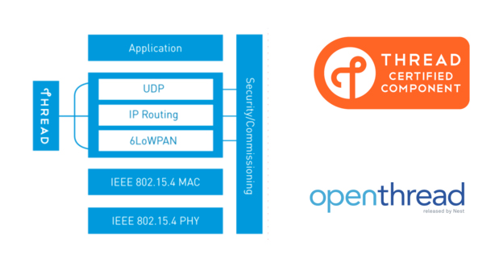
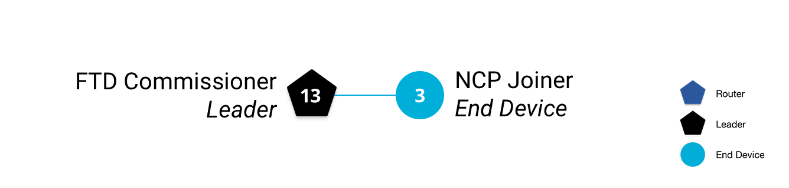

# OpenThread <br><small>An open-source implementation of Thread® released by Nest</small>

[](https://github.com/openthread/openthread)

## Introduction

[OpenThread](https://openthread.io/) is an open-source implementation of the [Thread®](http://threadgroup.org/) networking protocol. Nest has released OpenThread to make the networking technology used in Nest products more broadly available to developers, in order to accelerate the development of products for the connected home.

The [Thread specification](http://threadgroup.org/ThreadSpec) defines an IPv6-based reliable, secure and low-power wireless device-to-device communication protocol for home applications. OpenThread implements all Thread networking layers (IPv6, 6LoWPAN, IEEE 802.15.4 with MAC security, Mesh Link Establishment, Mesh Routing) and device roles, as well as Border Router support.



In the following documentation sections, you'll program OpenThread on nRF52840-MDK, create and manage a Thread network, and pass messages between nodes.


## Getting started

The following documentation sections provide detailed information about the required software toolchains.

### Install ARM GNU Toolchain

The GNU Embedded Toolchain for Arm is a ready-to-use, open source suite of tools for C, C++ and Assembly programming targeting Arm Cortex-M and Cortex-R family of processors. It includes the GNU Compiler (GCC) and is available free of charge directly from Arm for embedded software development on Windows, Linux and macOS operating systems.

Download and install the `6-2017-q2-update` version. Then make sure to add the path to your toolchain to your OS PATH environment variable:

<a href="https://developer.arm.com/open-source/gnu-toolchain/gnu-rm/downloads"><button data-md-color-primary="marsala">Download</button></a>

``` sh
# in ~/.bash_profile, add the following script
export PATH="<path to install directory>/gcc-arm-none-eabi-6-2017-q2-update/bin:${PATH}"
```

Adding the path makes it possible to run the toolchain executables from any directory using the terminal. To verify that the path is set correctly, type the following in your terminal:

``` sh
$ arm-none-eabi-gcc --version
```

### Install pyOCD

pyOCD is an Open Source python 2.7 based library for programming and debugging ARM Cortex-M microcontrollers using CMSIS-DAP. Linux, OSX and Windows are supported.

The latest stable version of pyOCD may be installed via [pip](https://pip.pypa.io/en/stable/index.html) as follows:

``` sh
$ pip install --pre -U pyocd
```

Follow [this section](../getting-started/#using-pyocd) for more information.

### Install wpantund

[wpantund](https://github.com/openthread/wpantund) is a user-space network interface driver/daemon that provides a native IPv6 network interface to a low-power wireless *Network Co-Processor* (or NCP). It was written and developed by Nest Labs to make supporting Thread connectivity on Unix-like operating systems more straightforward.

**wpantund** is designed to marshall all access to the NCP, ensuring that it always remains in a consistent and well-defined state.

Follow the [wpantund Installation Guide](https://github.com/openthread/wpantund/blob/master/INSTALL.md) from [openthread/wpantund](https://github.com/openthread/wpantund) to install **wpantund**.

### Clone OpenThread

Clone and install OpenThread:

``` sh
$ cd ~
$ git clone --recursive https://github.com/openthread/openthread.git
$ cd openthread
$ ./bootstrap
```

Specify platform configuration for nRF52840-MDK by dapting the `openthread/examples/platforms/nrf52840/platform-config.h` file to:

``` c
/**
 * @def UART_HWFC
 *
 * UART Hardware Flow Control.
 *
 * @brief Possible values:
 *         \ref NRF_UART_HWFC_ENABLED - HW Flow control enabled.
 *         \ref NRF_UART_HWFC_DISABLED - HW Flow control disabled.
 *
 */
#ifndef UART_HWFC
#define UART_HWFC NRF_UART_HWFC_DISABLED
#endif

/**
 * @def UART_PIN_TX
 *
 * UART TX Pin.
 *
 */
#ifndef UART_PIN_TX
#define UART_PIN_TX 20
#endif

/**
 * @def UART_PIN_RX
 *
 * UART RX Pin.
 *
 */
#ifndef UART_PIN_RX
#define UART_PIN_RX 19
#endif
```

Now you're ready to build and flash OpenThread to the nRF52840-MDK.

## Set up the NCP Joiner

### Build and flash

Build the OpenThread nRF52840 example with Joiner functionality. A device uses the Joiner role to be securely authenticated and commissioned onto a Thread network. Always clean the repo of previous builds first by running `make clean`.

``` sh
$ cd ~/openthread
$ make -f examples/Makefile-nrf52840 clean
$ make -f examples/Makefile-nrf52840 JOINER=1
```

!!! tip
	For more information on building and configuring OpenThread, see [Building OpenThread](https://openthread.io/guides/building/).

Navigate to the directory with the OpenThread FTD NCP binary, and convert it to hex format:

``` sh
$ cd ~/openthread/output/nrf52840/bin
$ arm-none-eabi-objcopy -O ihex ot-ncp-ftd ot-ncp-ftd.hex
```

Connect nRF52840-MDK to your computer with a USB cable. Use `pyocd-flashtool -l` to get the *boardId*:

``` sh
$ pyocd-flashtool -l

WARNING:root:Unsupported board found 1026
0 => Unknown Board [cortex_m] boardId => 10260000083ab20300000000000000000000000097969902
```

Flash the OpenThread NCP FTD hex file onto the nRF52840-MDK, using the *boardId*:

``` sh
$ pyocd-flashtool -t nrf52 -b 10260000083ab20300000000000000000000000097969902 -ce ot-ncp-ftd.hex
```


!!! tip
	Label the board **NCP** so that later you don't confuse the board roles.

### Configure wpantund

In the NCP design, use `wpantund` to communicate with and manage the Thread device.

In a terminal window, start `wpantund` on the serial port with the NCP, creating the interface `utun7` and enabling info logs:

``` sh
$ sudo /usr/local/sbin/wpantund -o Config:NCP:SocketPath /dev/cu.usbmodem14112  \
        -o Config:TUN:InterfaceName utun7 \
        -o Daemon:SyslogMask " -info"
```

!!! tip
	To configure wpantund without using command line parameters, modify the `/etc/wpantund.conf` file.

Output similar to the following is generated upon success:

``` sh
Jun  9 01:29:49  wpantund[12257] <Notice>: Starting wpantund 0.08.00d (Jun  9 2018 00:31:51) . . .
Jun  9 01:29:49  wpantund[12257] <Notice>: 	SOURCE_VERSION = 0.07.01-217-g86d29d6
Jun  9 01:29:49  wpantund[12257] <Notice>: 	BUILD_VERSION = 0.07.01-217-g86d29d6
Jun  9 01:29:49  wpantund[12257] <Notice>: Configuration file "/etc/wpantund.conf" read.
Jun  9 01:29:49  wpantund[12257] <Notice>: Ready. Using DBUS bus ":1.2"
Jun  9 01:29:49  wpantund[12257] <Notice>: Running as root without dropping privileges!
Jun  9 01:29:49  wpantund[12257] <Notice>: State change: "uninitialized" -> "offline"
Jun  9 01:29:49  wpantund[12257] <Notice>: NCP is running "OPENTHREAD/20170716-00584-ge4f5f240-dirty; NRF52840; Jun  8 2018 23:36:19"
Jun  9 01:29:49  wpantund[12257] <Notice>: Driver is running "0.08.00d (0.07.01-217-g86d29d6; Jun  9 2018 00:31:51)"
1:29:49  wpantund[12257] <Notice>: Network is not joinable
Jun  9 01:29:49  wpantund[12257] <Notice>: Resetting interface(s). . .
Jun  9 01:29:49  wpantund[12257] <Notice>: Finished initializing NCP
```

Leave this terminal window open so that logs from wpantund can be viewed.

A user-defined interface is required to communicate with the NCP using `wpanctl`. Open a new terminal window and using `wpanctl`, connect to the interface you just set up:

``` sh
$ sudo /usr/local/bin/wpanctl -I utun7
wpanctl:utun7>
```

### Verify build

Verify that the NCP is successfully running OpenThread:


## Set up the FTDs

The other two Thread nodes used in this section are Full Thread Devices (FTDs) on the standard System-on-Chip (SoC) design. They do not use `wpantund`, and the user manually manages them with the OpenThread CLI.

One device functions as the Commissioner, to securely authenticate and commission devices onto that network. The other device functions as a Joiner that the Commissioner can authenticate to the Thread network.

### Build and flash

Build the OpenThread FTD example for the nRF52840-MDK, with the Commissioner and Joiner roles enabled:

``` sh
$ cd ~/openthread
$ make -f examples/Makefile-nrf52840 clean
$ make -f examples/Makefile-nrf52840 COMMISSIONER=1 JOINER=1
```

!!! note
	Ideally, you should build OpenThread with only the desired functionality enabled. For example, the FTD Joiner would only use the `JOINER=1` switch. For ease of use here, build a single image with both roles so that the image can be used for both FTDs.

Navigate to the directory with the OpenThread Full Thread Device (FTD) CLI binary, and convert it to hex format:

``` sh
$ cd ~/openthread/output/nrf52840/bin
$ arm-none-eabi-objcopy -O ihex ot-cli-ftd ot-cli-ftd.hex
```

Connect another nRF52840-MDK to your computer with a USB cable. Use `pyocd-flashtool -l` to get the *boardId*:

``` sh
$ pyocd-flashtool -l
WARNING:root:Unsupported board found 1026
WARNING:root:Unsupported board found 1026
0 => Unknown Board [cortex_m] boardId => 10260000083ac27f00000000000000000000000097969902
1 => Unknown Board [cortex_m] boardId => 10260000083ab20300000000000000000000000097969902
```
Flash the OpenThread CLI FTD hex file onto the nRF52840-MDK, using the *boardId*:

``` sh
$ pyocd-flashtool -t nrf52 -b 10260000083ac27f00000000000000000000000097969902 -ce ot-cli-ftd.hex
```

!!! tip
	Label the board **Commissioner**.

### Verify build

Verify a successful build by accessing the OpenThread CLI using GNU Screen from a terminal window. The nRF52840-MDK boards use a baud rate of `115200`.

``` sh
$ screen /dev/cu.usbmodem142112 115200
```

In the new window, press <kbd>Return</kbd> on the keyboard a few times to bring up the OpenThread CLI `>` prompt. Check for IPv6 addresses:

``` sh
> ipaddr
fd11:2233:4455:0:99ea:1fe9:acd6:d384
fe80:0:0:0:2003:a240:810f:1598
Done
```

### Set up the FTD Joiner

Repeat the above process to flash the third nRF52840-MDK board, using the existing `ot-cli-ftd.hex` build. Then label the board **Joiner**.

Open a new terminal window, and then access the OpenThread CLI for the FTD Joiner:

``` sh
$ screen /dev/cu.usbmodem142412 115200
```

In this new window, press <kbd>Return</kbd> on the keyboard a few times to bring up the OpenThread CLI `>` prompt. Check for IPv6 addresses:

``` sh
> ipaddr
fe80:0:0:0:d079:7d86:6413:4f4e
fd11:2233:4455:0:e839:eb52:f7ec:74e3
Done
```

## Create the Thread network

Now that you have all your terminal windows and screens configured, let's create our Thread network. On the **FTD Commissioner**, configure the network and bring up Thread:

``` sh
## FTD Commissioner ##
----------------------

> networkname makerdiary
Done
> extpanid 1122334455667788
Done
> panid 0x1122
Done
> masterkey 11223344556677881122334455667788
Done
> ifconfig up
Done
> thread start
Done
```

After a moment, check the device state. It should be the Leader. Also get the RLOC16 for future reference.

``` sh
## FTD Commissioner ##
----------------------

> state
leader
Done
> rloc16
3400
Done
```

Check the device's IPv6 addresses:

``` sh
## FTD Commissioner ##
----------------------

> ipaddr
fd11:2233:4455:0:0:ff:fe00:fc00        # Leader Anycast Locator (ALOC)
fd11:2233:4455:0:0:ff:fe00:3400        # Routing Locator (RLOC)
fd11:2233:4455:0:99ea:1fe9:acd6:d384   # Mesh-Local EID (ML-EID)
fe80:0:0:0:2003:a240:810f:1598         # Link-Local Address (LLA)
Done
```

!!! tip
	A single Thread node has multiple IPv6 addresses. For more information, see [IPv6 Addressing](https://openthread.io/guides/thread_primer/ipv6_addressing#unicast_address_types).

The "makerdiary" network is now visible when scanned from other Thread devices.

From `wpanctl` on the **NCP Joiner**:

``` sh
## NCP Joiner ##
----------------

wpanctl:utun7> scan
   | Joinable | NetworkName        | PAN ID | Ch | XPanID           | HWAddr           | RSSI
---+----------+--------------------+--------+----+------------------+------------------+------
 1 |       NO | "makerdiary"       | 0x1122 | 11 | 1122334455667788 | 2203A240810F1598 |  -59
```

From the OpenThread CLI on the **FTD Joiner**:

``` sh
## FTD Joiner ##
----------------

> scan
| J | Network Name     | Extended PAN     | PAN  | MAC Address      | Ch | dBm | LQI |
+---+------------------+------------------+------+------------------+----+-----+-----+
> | 0 | makerdiary       | 1122334455667788 | 1122 | 2203a240810f1598 | 11 | -32 | 244 |
Done
```

If the `makerdiary` network doesn't appear in the list, try scanning again.

You may note that in both scans, the network seems to be not joinable (*Joinable* column on the NCP Joiner, *J* column on the FTD Joiner). This only means that Thread Commissioning is not active on the network. It can still be joined out-of-band, by entering the network master key in the joiner device manually.

!!! note 
	In-band commissioning is when network credentials are transferred to the joiner over the radio. Out-of-band commissioning is when they are given to the joiner by other means (for example, manual entry in the OpenThread CLI).

## Add the NCP Joiner

Let's add the NCP Joiner to the Thread network we just created, using an out-of-band process. Scan for networks on the **NCP Joiner**:

``` sh
## NCP Joiner ##
----------------

wpanctl:utun7> scan
   | Joinable | NetworkName        | PAN ID | Ch | XPanID           | HWAddr           | RSSI
---+----------+--------------------+--------+----+------------------+------------------+------
 1 |       NO | "makerdiary"       | 0x1122 | 11 | 1122334455667788 | EE7A6D71FB28C60D |  -68
```

To join, set the network master key on the NCP Joiner and join network 1 (the ID in the first column of the `scan` output):


``` sh
## NCP Joiner ##
----------------

wpanctl:utun7> setprop Network:Key 11223344556677881122334455667788
wpanctl:utun7> join 1
Joining "makerdiary" 1122334455667788 as node type "end-device"
Successfully Joined!
```

Check the status of the NCP Joiner to verify. It might take a few seconds for all IPv6 addresses to appear in the output.

``` sh
## NCP Joiner ##
----------------

wpanctl:utun7> status
utun7 => [
	"NCP:State" => "associated"
	"Daemon:Enabled" => true
	"NCP:Version" => "OPENTHREAD/20170716-00650-g631557e8-dirty; NRF52840; Jun  9 2018 15:45:03"
	"Daemon:Version" => "0.08.00d (0.07.01-217-g86d29d6; Jun  9 2018 00:31:51)"
	"Config:NCP:DriverName" => "spinel"
	"NCP:HardwareAddress" => [9019EC5D617D7AAB]
	"NCP:Channel" => 11
	"Network:NodeType" => "end-device"
	"Network:Name" => "makerdiary"
	"Network:XPANID" => 0x1122334455667788
	"Network:PANID" => 0x1122
	"IPv6:LinkLocalAddress" => "fe80::60bd:ff84:2121:344d"
	"IPv6:MeshLocalAddress" => "fd11:2233:4455::f:b5e:169b:b875"
	"IPv6:MeshLocalPrefix" => "fd11:2233:4455::/64"
	"com.nestlabs.internal:Network:AllowingJoin" => false
]
```

Make note of the `IPv6:MeshLocalAddress`, you'll use it later.

Get the NCP Joiner's RLOC16:

``` sh
## NCP Joiner ##
----------------

wpanctl:utun7> getprop Thread:RLOC16
Thread:RLOC16 = 0x3403
```

!!! tip
	Use the `getprop` command by itself to list all available properties and their current values.

Back on the **FTD Commissioner**, check the router and child tables to confirm both devices are part of the same network. Use the RLOC16 to identify the NCP Joiner.

``` sh
## FTD Commissioner ##
----------------------

> router table
| ID | RLOC16 | Next Hop | Path Cost | LQ In | LQ Out | Age | Extended MAC     |
+----+--------+----------+-----------+-------+--------+-----+------------------+
| 13 | 0x3400 |       63 |         0 |     0 |      0 |   0 | 2203a240810f1598 |

Done
> child table
| ID  | RLOC16 | Timeout    | Age        | LQ In | C_VN |R|S|D|N| Extended MAC     |
+-----+--------+------------+------------+-------+------+-+-+-+-+------------------+
|   3 | 0x3403 |        240 |         66 |     3 |   86 |1|1|1|1| 62bdff842121344d |

Done
```

Ping the mesh-local address of the NCP Joiner (the `IPv6:MeshLocalAddress` attribute from the NCP Joiner's `status` output) to verify connectivity:

``` sh
## FTD Commissioner ##
----------------------

> ping fd11:2233:4455::f:b5e:169b:b875
> 8 bytes from fd11:2233:4455:0:f:b5e:169b:b875: icmp_seq=2 hlim=64 time=35ms
```

We now have a Thread network consisting of two nodes, illustrated by this topology diagram:



## Commission the FTD Joiner

Now let's add the third Thread device to the "makerdiary" network. This time we're going to use the more secure in-band commissioning process. On the **FTD Joiner**, scan for the network:

``` 
## FTD Joiner ##
----------------

> scan
| J | Network Name     | Extended PAN     | PAN  | MAC Address      | Ch | dBm | LQI |
+---+------------------+------------------+------+------------------+----+-----+-----+
> | 0 | makerdiary       | 1122334455667788 | 1122 | 2203a240810f1598 | 11 | -32 | 244 |
Done
```

A `0` in the J column indicates that Thread Commissioning is not active on the device.

Let's be specific when commissioning on this next device, and only allow the FTD Joiner to join. Still on the FTD Joiner, get the `eui64`, so the FTD Commissioner can identify it:

``` sh
## FTD Joiner ##
----------------

> eui64
31ae3e8e7b87cfd6
Done
```

On the **FTD Commissioner**, start the commissioner and specify the `eui64` of the device that can join, along with the Joiner Credential. The Joiner Credential is a device-specific passphrase.

``` sh
## FTD Commissioner ##
----------------------

> commissioner start
Done
> commissioner joiner add 31ae3e8e7b87cfd6 J01NME
Done
```

!!! warning
	If you get an error when run the `commissioner joiner` command, stop and restart the commissioner role with `commissioner stop` and `commissioner start`, then try the `commissioner joiner` command again.

Switch to the **FTD Joiner**, and rescan:

``` sh
## FTD Joiner ##
----------------

> scan
| J | Network Name     | Extended PAN     | PAN  | MAC Address      | Ch | dBm | LQI |
+---+------------------+------------------+------+------------------+----+-----+-----+
> | 1 | makerdiary       | 1122334455667788 | 1122 | 2203a240810f1598 | 11 | -32 | 244 |
Done
```

As indicated by the `1` in the J column, Thread Commissioning is now active on the network. Start the joiner role with the Joiner Credential you just set up on the FTD Commissioner:

``` sh
## FTD Joiner ##
----------------

> ifconfig up
Done
> joiner start J01NME
Done
```

Within a minute or so, you get a confirmation of a successful authentication:

``` sh
## FTD Joiner ##
----------------

>Join success
```

!!! warning
	If you wait too long (more than a few minutes) to start the joiner role on the FTD Joiner, the commissioner may time out and the join fail. Stop and restart the commissioner and try it again.

Bring up Thread so the FTD Joiner joins the `makerdiary` network, and immediately check the state and RLOC16:

``` sh
## FTD Joiner ##
----------------

> thread start
Done
> state
child
Done
> rloc16
3404
Done
```

Check the device's IPv6 addresses. Notice that there is no ALOC. That's because this device is not the Leader, nor does it hold an Anycast-specific role that requires an ALOC.

``` sh
## FTD Joiner ##
----------------

> ipaddr
fd11:2233:4455:0:0:ff:fe00:3404
fe80:0:0:0:7827:55cf:47e4:5907
fd11:2233:4455:0:e839:eb52:f7ec:74e3
Done
```

Immediately switch to the **FTD Commissioner** and check the router and child tables to confirm that three devices exist in the `makerdiary` network:

``` sh
## FTD Commissioner ##
----------------------

> router table
| ID | RLOC16 | Next Hop | Path Cost | LQ In | LQ Out | Age | Extended MAC     |
+----+--------+----------+-----------+-------+--------+-----+------------------+
| 13 | 0x3400 |       63 |         0 |     0 |      0 |   0 | 2203a240810f1598 |

Done
> child table
| ID  | RLOC16 | Timeout    | Age        | LQ In | C_VN |R|S|D|N| Extended MAC     |
+-----+--------+------------+------------+-------+------+-+-+-+-+------------------+
|   3 | 0x3403 |        240 |        231 |     3 |   86 |1|1|1|1| 62bdff842121344d |
|   4 | 0x3404 |        240 |         49 |     3 |   88 |1|1|1|1| 7a2755cf47e45907 |

Done
```

!!! important
	It's possible that by the time you check the router and child tables, you see two Routers and one End Device (child). If so, don't worry! You did nothing wrong. Continue on to learn why this happened.

Based on the RLOC16, the FTD Joiner has attached to the network as an End Device (child). Here is our updated topology:


## Thread in action

The Thread devices in this documentation are a specific kind of Full Thread Device (FTD) called a Router Eligible End Device (REED). This means they can function as either a Router or End Device, and can promote themselves from an End Device to a Router.

Thread can support up to 32 Routers, but tries to keep the number of Routers between 16 and 23. If a REED attaches as an End Device (child) and the number of Routers is below 16, after a random time period within two minutes it automatically promotes itself to a Router.

If you had two children in your Thread network after adding the FTD Joiner, wait at least two minutes, and then recheck the router and child tables on the **FTD Commissioner**:

``` sh
## FTD Commissioner ##
----------------------

> router table
| ID | RLOC16 | Next Hop | Path Cost | LQ In | LQ Out | Age | Extended MAC     |
+----+--------+----------+-----------+-------+--------+-----+------------------+
| 13 | 0x3400 |       63 |         0 |     0 |      0 |   0 | 2203a240810f1598 |
| 61 | 0xf400 |       63 |         0 |     3 |      3 |  10 | 7a2755cf47e45907 |

Done
> child table
| ID  | RLOC16 | Timeout    | Age        | LQ In | C_VN |R|S|D|N| Extended MAC     |
+-----+--------+------------+------------+-------+------+-+-+-+-+------------------+
|   3 | 0x3403 |        240 |        109 |     3 |   86 |1|1|1|1| 62bdff842121344d |

Done
```

The FTD Joiner (Extended MAC = `7a2755cf47e45907`) has promoted itself to a Router. Note that the RLOC16 is different (`f400` instead of `3404`). That's because the RLOC16 is based on the Router ID and Child ID of a device. When it transitions from End Device to Router, its Router ID and Child ID values change, and so does the RLOC16.


Confirm the new state and RLOC16 on the **FTD Joiner**:

``` sh
## FTD Joiner ##
----------------

> state
router
Done
> rloc16
f400
Done
```

### Downgrade the FTD Joiner

You can test this behavior by manually downgrading the **FTD Joiner** from a Router back to an End Device. Change the state to child and check the RLOC16:

``` sh
## FTD Joiner ##
----------------

> state child
Done
> rloc16
3406
Done
> state
child
Done
```


Back on the FTD Commissioner, the FTD Joiner should now appear in the child table (ID = 6). It may even be in both while it transitions:

``` sh
## FTD Commissioner ##
----------------------

> router table
| ID | RLOC16 | Next Hop | Path Cost | LQ In | LQ Out | Age | Extended MAC     |
+----+--------+----------+-----------+-------+--------+-----+------------------+
| 13 | 0x3400 |       63 |         0 |     0 |      0 |   0 | 2203a240810f1598 |
| 61 | 0xf400 |       63 |         0 |     0 |      0 |  16 | 7a2755cf47e45907 |

Done
> child table
| ID  | RLOC16 | Timeout    | Age        | LQ In | C_VN |R|S|D|N| Extended MAC     |
+-----+--------+------------+------------+-------+------+-+-+-+-+------------------+
|   3 | 0x3403 |        240 |         62 |     3 |   86 |1|1|1|1| 62bdff842121344d |
|   6 | 0x3406 |        240 |         25 |     3 |   89 |1|1|1|1| 7a2755cf47e45907 |

Done
```

After some time, it will switch back to a Router with an RLOC of `f400`.

``` sh
## FTD Joiner ##
----------------

> state
router
Done
> rloc16
f400
Done
```


### Remove the Leader
The Leader is self-elected among all Thread Routers. This means if the current Leader is removed from the Thread network, one of the other Routers will become the new Leader.

On the **FTD Commissioner**, shut down Thread to remove it from the Thread network:

``` sh
## FTD Commissioner ##
----------------------

> thread stop
Done
> ifconfig down
Done
```

Within two minutes, the **FTD Joiner** becomes the new Thread leader. Check the state and IPv6 addresses of the FTD Joiner to verify:

``` sh
## FTD Joiner ##
----------------

> state
leader
Done
> ipaddr
fd11:2233:4455:0:0:ff:fe00:fc00       # Now it has the Leader ALOC!
fd11:2233:4455:0:0:ff:fe00:f400
fe80:0:0:0:7827:55cf:47e4:5907
fd11:2233:4455:0:e839:eb52:f7ec:74e3
Done
```


Check the child table. Notice that there's a new RLOC16. This is the NCP Joiner, as indicated by its ID and Extended MAC. In order to keep the Thread network together, it has switched parent Routers, from the FTD Commissioner to the FTD Joiner. This results in a new RLOC16 for the NCP Joiner (because its Router ID changed, from 13 to 61).

``` sh
## FTD Joiner ##
----------------

> child table
| ID  | RLOC16 | Timeout    | Age        | LQ In | C_VN |R|S|D|N| Extended MAC     |
+-----+--------+------------+------------+-------+------+-+-+-+-+------------------+
|   1 | 0xf401 |        240 |         21 |     3 |   36 |1|1|1|1| 62bdff842121344d |

Done
```

You may have to wait a few minutes for the **NCP Joiner** to attach to the FTD Joiner as a child. If you have the **wpantund** window visible, there should be new output as it associates with a new parent:

``` sh
## wpantund ##
--------------

Jun  9 16:12:53  wpantund[12257] <Notice>: Node type change: "end-device" -> "unknown"
Jun  9 16:12:53  wpantund[12257] <Notice>: State change: "associated" -> "associated:no-parent"
Jun  9 16:12:53  wpantund[12257] <Notice>: Taking interface(s) down. . .
Jun  9 16:14:14  wpantund[12257] <Notice>: State change: "associated:no-parent" -> "associated"
Jun  9 16:14:14  wpantund[12257] <Notice>: Node type change: "unknown" -> "end-device"
```

Switch to the NCP Joiner and check the RLOC16 to confirm that it has changed:

``` sh
## NCP Joiner ##
----------------

wpanctl:utun7> getprop Thread:RLOC16
Thread:RLOC16 = 0xF401
```

### Reattach the FTD Commissioner

A Thread network with two nodes isn't much fun. Let's bring the FTD Commissioner back online.

On the **FTD Commissioner**, restart Thread:

``` sh
## FTD Commissioner ##
----------------------

> ifconfig up
Done
> thread start
Done
```

Within two minutes, it automatically reattaches to the `makerdiary` network as an End Device, and then promotes itself to a Router.

``` sh
## FTD Commissioner ##
----------------------

> state
child
Done
> state
router
Done
```

Check the router and child tables on the **FTD Joiner** to verify:

``` sh
## FTD Joiner ##
----------------

> router table
| ID | RLOC16 | Next Hop | Path Cost | LQ In | LQ Out | Age | Extended MAC     |
+----+--------+----------+-----------+-------+--------+-----+------------------+
| 13 | 0x3400 |       63 |         0 |     3 |      3 |   6 | 2203a240810f1598 |
| 61 | 0xf400 |       63 |         0 |     0 |      0 |   0 | 7a2755cf47e45907 |

Done
> child table
| ID  | RLOC16 | Timeout    | Age        | LQ In | C_VN |R|S|D|N| Extended MAC     |
+-----+--------+------------+------------+-------+------+-+-+-+-+------------------+
|   1 | 0xf401 |        240 |         18 |     3 |   36 |1|1|1|1| 62bdff842121344d |

Done
```


Our Thread network consists of three nodes again.

!!! tip "Within two minutes..."
	120 seconds is the default value of a Thread Network parameter called ROUTER_SELECTION_JITTER. Devices changing from End Device to Router or vice versa delay the change for a random period between 0 and the ROUTER_SELECTION_JITTER (in seconds). See the [Thread Specification](http://threadgroup.org/technology/ourtechnology#specifications) for more information on Thread Network parameters.

## Troubleshooting

Managing a Thread network with multiple devices on different terminal or Screen windows can be complicated. Use these tips to "reset" the state of the network or your workspace if you encounter issues.

### Screen

If you ever get lost in your configuration (too many Screen windows, or Screens within Screen), keep killing Screen windows with <kbd>Ctrl</kbd> + <kbd>a</kbd> → <kbd>k</kbd> until none exist and `screen -ls` on the command line outputs `No Sockets found`. Then recreate Screen windows for each device. Device states are retained even when Screen is killed.

### Thread nodes
If the Thread network topology is not as described in this documentation, or nodes disconnect for some reason (perhaps because the host machine powering them went to sleep), it's best to bring down Thread, clear the network credentials, and begin again from the [Create the Thread network](#create-the-thread-network) step.

To reset the FTDs:

``` sh
## FTD Commissioner or FTD Joiner ##
------------------------------------

> thread stop
Done
> ifconfig down
Done
> factoryreset
Done
```

To reset the NCP:

``` sh
## NCP Joiner ##
----------------

wpanctl:utun7> leave
Leaving current WPAN. . .
wpanctl:utun7> reset
Resetting NCP. . .
```

## Send messages with UDP

One of the application services that OpenThread provides is User Datagram Protocol (UDP), a Transport Layer protocol. An application built on OpenThread could use the UDP API to pass messages between nodes in a Thread network, or to other devices in an external network (like the internet, if the Thread network features a Border Router).

UDP sockets are exposed through the OpenThread CLI. Let's use it to pass messages between the two FTDs.

Get the Mesh-Local EID address for the **FTD Joiner**. We're using this address because it's reachable from anywhere within the Thread network.

``` sh
## FTD Joiner ##
----------------

> ipaddr
fd11:2233:4455:0:0:ff:fe00:fc00        # Leader Anycast Locator (ALOC)
fd11:2233:4455:0:0:ff:fe00:f400        # Routing Locator (RLOC)
fe80:0:0:0:7827:55cf:47e4:5907         # Link-Local Address (LLA)
fd11:2233:4455:0:e839:eb52:f7ec:74e3   # Mesh-Local EID (ML-EID)
Done
```

Start UDP and bind it to a socket for any IPv6 address:

``` sh
## FTD Joiner ##
----------------

> udp open
Done
> udp bind :: 1212
```

Switch to the **FTD Commissioner**, start UDP, and connect to the socket you set up on the FTD Joiner, using its ML-EID:

``` 
## FTD Commissioner ##
----------------------

> udp open
Done
> udp connect fd11:2233:4455:0:e839:eb52:f7ec:74e3 1212
Done
```

The UDP connection should be live between the two nodes. Send a message from the FTD Commissioner:

``` sh
## FTD Commissioner ##
----------------------

> udp send hello-openthread
Done
```

On the **FTD Joiner**, the UDP message has been received!

``` sh
## FTD Joiner ##
----------------

> 16 bytes from fd11:2233:4455:0:0:ff:fe00:3400 49153 hello-openthread
```

## Congratulations!

You've created a physical Thread network!


## Reference

* [openthread.io](https://openthread.io)
* [github.com/openthread](https://github.com/openthread/openthread/)
* [codelabs.developers.google.com](https://codelabs.developers.google.com/)
* [Thread Primer](https://openthread.io/guides/thread_primer/) — covers all the Thread concepts in this documentation
* [OpenThread CLI reference](https://github.com/openthread/openthread/blob/master/src/cli/README.md)
* [OpenThread UDP CLI reference](https://github.com/openthread/openthread/blob/master/src/cli/README_UDP.md)
* [wpanctl properties reference](https://github.com/openthread/wpantund/blob/c3f43e8fa9670f1688f99a02c7ccc9f1bfaa3718/src/wpantund/wpan-properties.h)
* [OpenThread UDP API reference](https://openthread.io/reference/group/api-udp)
* [GNU Screen quick reference](http://aperiodic.net/screen/quick_reference)

## Create an Issue

Interested in contributing to this project? Want to report a bug? Feel free and click here:

<a href="https://github.com/makerdiary/nrf52840-mdk/issues/new"><button data-md-color-primary="marsala"><i class="fa fa-github"></i> Create an Issue</button></a>

